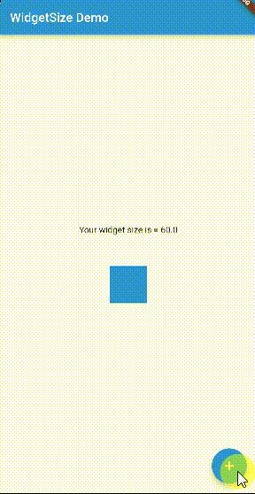

# widget_size
[](https://pub.dartlang.org/packages/widget_size)

A widget to calculate it's size after being built and attached to a widget tree



## Usage

To use this plugin, add [widget_size](https://pub.dartlang.org/packages/widget_size/install) as a dependency in your pubspec.yaml file.

```yaml
dependencies:
  widget_size: ^lastVersion
```

## Example

```dart
WidgetSize(
  onChange: (Size size) {
    // your Widget size available here
  },
  child: Container(
    height: _widgetSize,
    width: _widgetSize,
    color: Theme.of(context).primaryColor,
  ),
)
```
